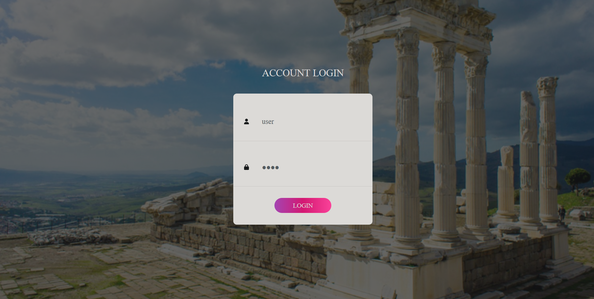

This repository was created for completing the tasks for entering at "Platforma de informare - pentru Aeroportul International Timisoara" laboratory.

The tasks can be found [**here**](https://github.com/bigbrain2000/LibraryApp/blob/main/src/main/resources/template/Pergamum%20library%20-%20Backend%20test%20ACLabs%202022.pdf).

This was my first attempt using Spring framework and I tried to fulfill the requirements while using a simple interface.

As database I used [PostgreSQL](https://www.postgresql.org/) .

In order to launch the app you need to replace the credentials from [application.properties](#https://github.com/bigbrain2000/LibraryApp/blob/main/src/main/resources/application.properties) with your correct credential to connect to the PostgreSQL server:

### Logging into the application

The application is hosted on **localhost:8080**

For logging into the application you can use a predefined user with:
<pre>
username = "user"
password = "user"
</pre>

A window like this will appear

I adapted the login template based on my needs,the original template can be found [here](#https://colorlib.com/wp/template/login-form-v16/) .

After login, a user can see a navigation bar with buttons that lead to every endpoint requested in tasks.
For example, this is the page where all books from the library are sorted in ascending order:

***Note: I did not create any exceptions handlers, in case of login with another user than the one predefined or adding a book already existing will lead to mapping an error.***
